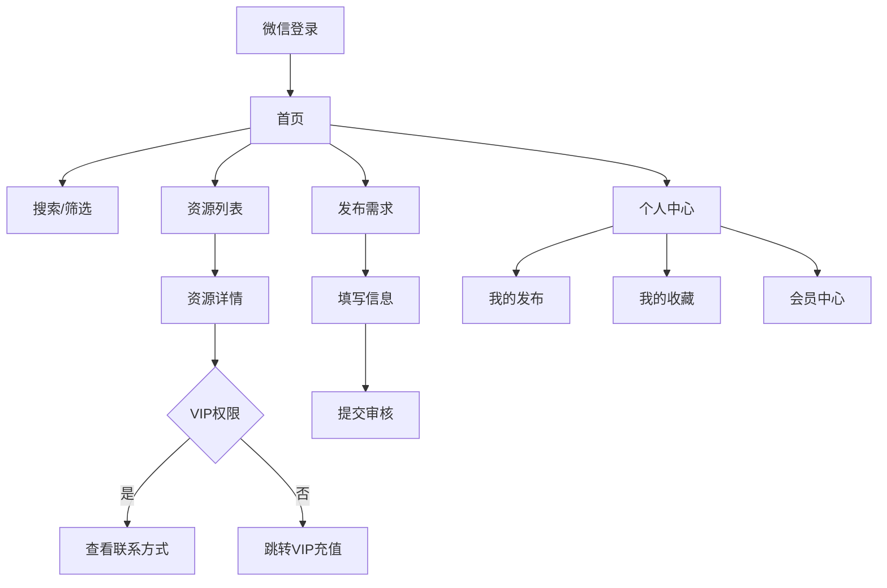

## 1. 产品概述
宠物同行小程序是一个专注于宠物行业的B2B资源对接平台，帮助宠物行业从业者快速找到合作伙伴和资源。
- 解决宠物行业信息不对称问题，让从业者高效对接资源
- 面向宠物行业从业者，包括工厂、品牌方、经销商、服务商等
- 通过微信小程序提供便捷的移动端体验

## 2. 核心功能

### 2.1 用户角色
| 角色 | 注册方式 | 核心权限 |
|------|----------|----------|
| 普通用户 | 微信授权登录 | 浏览基础信息、发布需求 |
| VIP会员 | 微信授权+付费升级 | 查看联系方式、享受更多功能 |

### 2.2 功能模块
宠物同行小程序包含以下核心页面：
1. **首页**：搜索框、分类筛选、资源列表展示
2. **发布页**：登记需求信息、上传图片
3. **个人中心**：个人信息、会员状态、我的发布、我的收藏
4. **资源详情页**：详细信息、联系方式（VIP可见）
5. **会员充值页**：VIP开通和续费
6. **微信群页面**：群介绍和群主微信号
7. **宠物展页面**：展会信息展示

### 2.3 页面详情
| 页面名称 | 模块名称 | 功能描述 |
|----------|----------|----------|
| 首页 | 搜索模块 | 支持关键词搜索同行信息 |
| 首页 | 分类筛选 | 多选框筛选：全部、源头工厂、繁育商家、品牌方、经销商、B端服务、全域电商、本地商家、新兴服务、媒体达人、行业组织 |
| 首页 | 权限获取 | 点击查看权限按钮跳转VIP充值页面 |
| 首页 | 资源列表 | 展示职位身份&姓名、城市、头像、品牌名/公司名、业务类别、需求、介绍、编号 |
| 首页 | 底部导航 | 资源库、+、我 三个Tab切换 |
| 发布页 | 基本信息 | 填写品牌/公司/产品名称、所在城市、职位身份&姓名 |
| 发布页 | 联系方式 | 手机、微信至少填一项 |
| 发布页 | 业务类别 | 详细子分类选择（如源头工厂下的食品工厂、用品工厂等） |
| 发布页 | 介绍描述 | 品牌/产品/服务描述，便于同行搜索 |
| 发布页 | 合作需求 | 填写需要找的资源或客户 |
| 发布页 | 图片上传 | 上传产品图片（选填）、报价图片（选填） |
| 发布页 | 发布按钮 | 提交后需管理员审核通过才能展示 |
| 个人中心 | 个人信息 | 显示头像、名称、ID、会员状态 |
| 个人中心 | 功能入口 | 微信群、宠物展、我发布的、我收藏的 |
| 个人中心 | 客服联系 | 浮窗式客服入口 |
| 资源详情页 | 基本信息 | 展示头像、名称、类别、业务类别、介绍 |
| 资源详情页 | 联系方式 | 手机和微信号（仅VIP会员可见） |
| 资源详情页 | 需求信息 | 展示合作需求 |
| 资源详情页 | 操作功能 | 收藏、分享、返回首页 |
| 会员充值页 | VIP介绍 | 展示会员权益和价格 |
| 会员充值页 | 支付功能 | 支持微信支付开通会员 |
| 微信群页面 | 群介绍 | 展示对接群介绍信息 |
| 微信群页面 | 复制功能 | 一键复制群主微信号 |
| 宠物展页面 | 展会列表 | 展示近期展会时间、地址信息 |

## 3. 核心流程

### 普通用户流程
1. 微信授权登录小程序
2. 浏览首页资源列表，使用搜索和筛选功能
3. 点击资源卡片查看详情（基础信息可见）
4. 如需查看联系方式，点击获取权限跳转VIP充值
5. 可在发布页登记自己的需求信息
6. 在个人中心查看自己的发布和收藏

### VIP用户流程
1. 微信授权登录后开通VIP会员
2. 可查看所有资源的完整联系方式
3. 享受更多高级功能和优先服务

## 4. 用户界面设计

### 4.1 设计风格
- **主色调**：宠物友好的温暖色系，主色#FF6B35（橙色），辅色#4ECDC4（青色）
- **按钮样式**：圆角矩形，3D微阴影效果
- **字体**：微信默认字体，标题18px，正文14px，小字12px
- **布局风格**：卡片式布局，清晰的信息层级
- **图标风格**：圆润的线性图标，符合宠物主题

### 4.2 页面设计概述
| 页面名称 | 模块名称 | UI元素 |
|----------|----------|----------|
| 首页 | 搜索区域 | 顶部搜索框，圆角设计，占位文字"搜索同行资源" |
| 首页 | 分类筛选 | 横向滚动分类标签，选中状态高亮显示 |
| 首页 | 资源卡片 | 头像圆形48px，名称16px加粗，城市标签12px，业务类别彩色标签 |
| 首页 | 底部导航 | 图标+文字，选中状态变色，未选中灰色 |
| 发布页 | 表单区域 | 分组标题14px灰色，输入框圆角边框，必填项红色星号 |
| 发布页 | 分类选择 | 级联选择器，支持多级分类展开 |
| 发布页 | 图片上传 | 九宫格图片上传，支持预览和删除 |
| 个人中心 | 头部信息 | 头像圆形64px，名称18px，ID12px灰色，会员标识彩色 |
| 资源详情页 | 信息展示 | 头像+名称组合，联系信息分组展示，VIP锁图标 |

### 4.3 响应式设计
- **移动端优先**：专为微信小程序设计，适配各种手机屏幕
- **适配原则**：重要信息优先显示，支持滑动操作
- **交互优化**：触摸区域最小44px，支持手势操作

### 4.4 性能要求
- 页面加载时间不超过2秒
- 图片懒加载，支持渐进式显示
- 列表分页加载，每页20条数据

