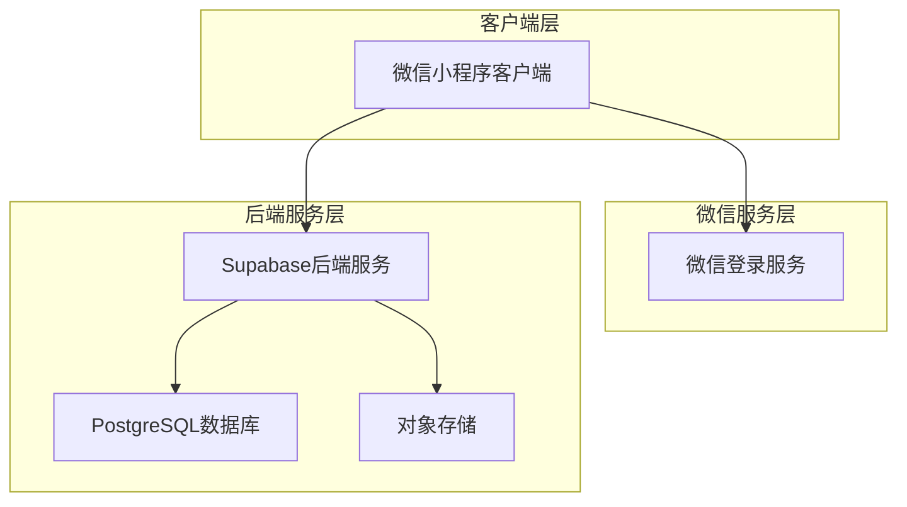
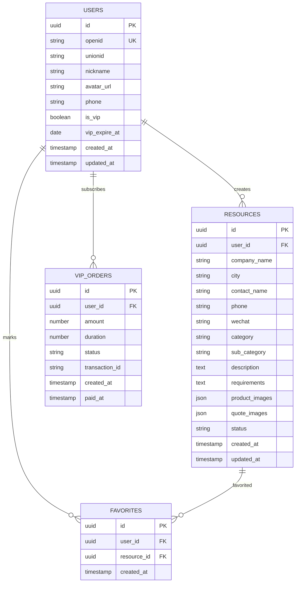

## 1. 架构设计



## 2. 技术描述

- **前端**：微信小程序原生框架 + uni-app跨平台框架
- **初始化工具**：HBuilderX（uni-app官方IDE）
- **后端**：Supabase（PostgreSQL + Auth + Storage）
- **部署**：微信小程序云开发 + Supabase云服务

## 3. 路由定义

| 路由 | 用途 |
|------|------|
| /pages/index/index | 首页，展示资源列表和搜索功能 |
| /pages/publish/publish | 发布页，登记需求信息 |
| /pages/profile/profile | 个人中心，用户信息和功能入口 |
| /pages/detail/detail | 资源详情页，展示详细信息 |
| /pages/vip/vip | 会员充值页，VIP开通和续费 |
| /pages/wechat-groups/wechat-groups | 微信群页面，群介绍和复制功能 |
| /pages/exhibition/exhibition | 宠物展页面，展会信息列表 |
| /pages/login/login | 登录页，微信授权登录 |

## 4. API定义

### 4.1 认证相关API

**微信登录**
```
POST /api/auth/wechat-login
```

请求参数：
| 参数名 | 参数类型 | 是否必需 | 描述 |
|--------|----------|----------|------|
| code | string | 是 | 微信登录code |
| userInfo | object | 是 | 微信用户信息 |

响应参数：
| 参数名 | 参数类型 | 描述 |
|--------|----------|------|
| token | string | JWT访问令牌 |
| user | object | 用户信息对象 |
| isVip | boolean | VIP状态 |

### 4.2 资源相关API

**获取资源列表**
```
GET /api/resources
```

请求参数：
| 参数名 | 参数类型 | 是否必需 | 描述 |
|--------|----------|----------|------|
| keyword | string | 否 | 搜索关键词 |
| category | string | 否 | 分类筛选 |
| city | string | 否 | 城市筛选 |
| page | number | 否 | 页码，默认1 |
| limit | number | 否 | 每页数量，默认20 |

响应参数：
| 参数名 | 参数类型 | 描述 |
|--------|----------|------|
| list | array | 资源列表数据 |
| total | number | 总记录数 |
| hasMore | boolean | 是否有更多数据 |

**发布资源**
```
POST /api/resources
```

请求参数：
| 参数名 | 参数类型 | 是否必需 | 描述 |
|--------|----------|----------|------|
| companyName | string | 是 | 公司/品牌名称 |
| city | string | 是 | 所在城市 |
| position | string | 是 | 职位身份 |
| contactName | string | 是 | 联系人姓名 |
| phone | string | 否 | 联系电话 |
| wechat | string | 否 | 微信号 |
| category | string | 是 | 业务类别 |
| subCategory | string | 是 | 子分类 |
| description | string | 是 | 品牌/产品介绍 |
| requirements | string | 是 | 合作需求 |
| productImages | array | 否 | 产品图片URL数组 |
| quoteImages | array | 否 | 报价图片URL数组 |

### 4.3 会员相关API

**开通VIP**
```
POST /api/vip/subscribe
```

请求参数：
| 参数名 | 参数类型 | 是否必需 | 描述 |
|--------|----------|----------|------|
| duration | number | 是 | 订阅时长（月） |
| paymentMethod | string | 是 | 支付方式 |

## 5. 数据模型

### 5.1 数据模型定义



### 5.2 数据定义语言

**用户表（users）**
```sql
-- 创建用户表
CREATE TABLE users (
    id UUID PRIMARY KEY DEFAULT gen_random_uuid(),
    openid VARCHAR(100) UNIQUE NOT NULL,
    unionid VARCHAR(100),
    nickname VARCHAR(100),
    avatar_url TEXT,
    phone VARCHAR(20),
    is_vip BOOLEAN DEFAULT FALSE,
    vip_expire_at TIMESTAMP WITH TIME ZONE,
    created_at TIMESTAMP WITH TIME ZONE DEFAULT NOW(),
    updated_at TIMESTAMP WITH TIME ZONE DEFAULT NOW()
);

-- 创建索引
CREATE INDEX idx_users_openid ON users(openid);
CREATE INDEX idx_users_vip ON users(is_vip);
```

**资源表（resources）**
```sql
-- 创建资源表
CREATE TABLE resources (
    id UUID PRIMARY KEY DEFAULT gen_random_uuid(),
    user_id UUID REFERENCES users(id) ON DELETE CASCADE,
    company_name VARCHAR(200) NOT NULL,
    city VARCHAR(50) NOT NULL,
    contact_name VARCHAR(100) NOT NULL,
    phone VARCHAR(20),
    wechat VARCHAR(50),
    category VARCHAR(50) NOT NULL,
    sub_category VARCHAR(50) NOT NULL,
    description TEXT NOT NULL,
    requirements TEXT NOT NULL,
    product_images JSONB DEFAULT '[]',
    quote_images JSONB DEFAULT '[]',
    status VARCHAR(20) DEFAULT 'pending' CHECK (status IN ('pending', 'approved', 'rejected')),
    created_at TIMESTAMP WITH TIME ZONE DEFAULT NOW(),
    updated_at TIMESTAMP WITH TIME ZONE DEFAULT NOW()
);

-- 创建索引
CREATE INDEX idx_resources_user_id ON resources(user_id);
CREATE INDEX idx_resources_category ON resources(category);
CREATE INDEX idx_resources_city ON resources(city);
CREATE INDEX idx_resources_status ON resources(status);
CREATE INDEX idx_resources_created_at ON resources(created_at DESC);
```

**收藏表（favorites）**
```sql
-- 创建收藏表
CREATE TABLE favorites (
    id UUID PRIMARY KEY DEFAULT gen_random_uuid(),
    user_id UUID REFERENCES users(id) ON DELETE CASCADE,
    resource_id UUID REFERENCES resources(id) ON DELETE CASCADE,
    created_at TIMESTAMP WITH TIME ZONE DEFAULT NOW(),
    UNIQUE(user_id, resource_id)
);

-- 创建索引
CREATE INDEX idx_favorites_user_id ON favorites(user_id);
CREATE INDEX idx_favorites_resource_id ON favorites(resource_id);
```

**VIP订单表（vip_orders）**
```sql
-- 创建VIP订单表
CREATE TABLE vip_orders (
    id UUID PRIMARY KEY DEFAULT gen_random_uuid(),
    user_id UUID REFERENCES users(id) ON DELETE CASCADE,
    amount INTEGER NOT NULL,
    duration INTEGER NOT NULL,
    status VARCHAR(20) DEFAULT 'pending' CHECK (status IN ('pending', 'paid', 'failed')),
    transaction_id VARCHAR(100),
    created_at TIMESTAMP WITH TIME ZONE DEFAULT NOW(),
    paid_at TIMESTAMP WITH TIME ZONE
);

-- 创建索引
CREATE INDEX idx_vip_orders_user_id ON vip_orders(user_id);
CREATE INDEX idx_vip_orders_status ON vip_orders(status);
```

### 5.3 权限设置

**基础权限设置**
```sql
-- 匿名用户权限
GRANT SELECT ON resources TO anon;
GRANT SELECT ON users TO anon;

-- 认证用户权限
GRANT ALL PRIVILEGES ON resources TO authenticated;
GRANT ALL PRIVILEGES ON favorites TO authenticated;
GRANT ALL PRIVILEGES ON vip_orders TO authenticated;
GRANT SELECT, UPDATE ON users TO authenticated;
```

**行级安全策略**
```sql
-- 资源表策略
ALTER TABLE resources ENABLE ROW LEVEL SECURITY;

-- 用户只能查看已审核的资源
CREATE POLICY "View approved resources" ON resources
    FOR SELECT
    USING (status = 'approved');

-- 用户可以查看自己的所有资源
CREATE POLICY "Users can view own resources" ON resources
    FOR SELECT
    USING (auth.uid() = user_id);

-- 用户只能更新自己的资源
CREATE POLICY "Users can update own resources" ON resources
    FOR ALL
    USING (auth.uid() = user_id);
```

## 6. 部署架构

### 6.1 开发环境
- **前端开发**：HBuilderX + 微信开发者工具
- **后端服务**：Supabase本地开发环境
- **版本控制**：Git代码仓库

### 6.2 生产环境
- **小程序托管**：微信小程序平台
- **后端服务**：Supabase云服务
- **CDN加速**：图片和静态资源使用CDN加速
- **监控告警**：应用性能监控和错误追踪

### 6.3 安全配置
- **HTTPS**：所有API请求使用HTTPS协议
- **身份验证**：JWT令牌验证用户身份
- **数据加密**：敏感数据加密存储
- **访问控制**：基于角色的权限管理

